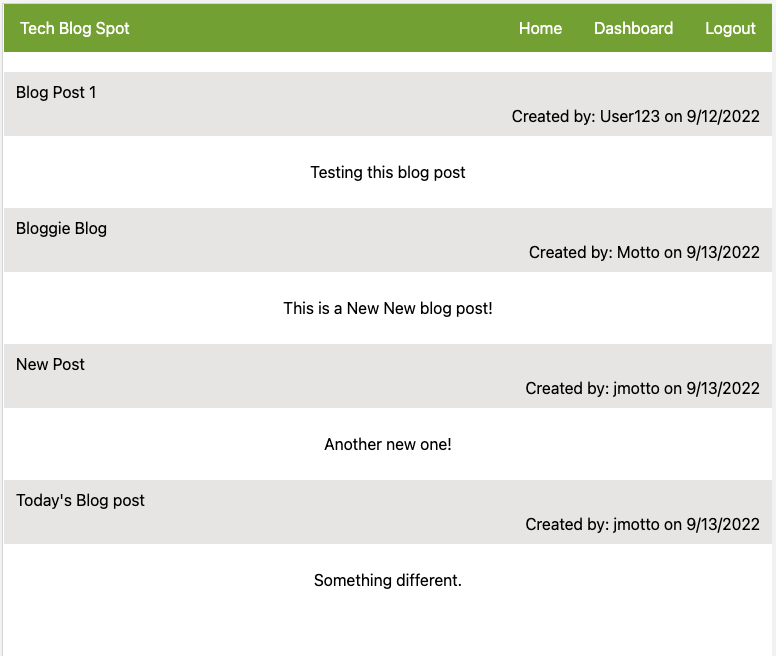
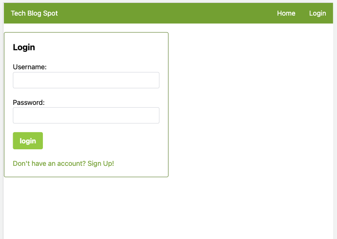
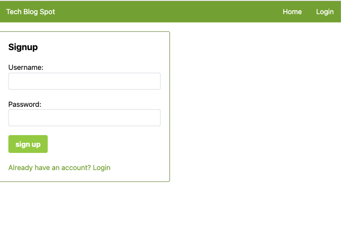
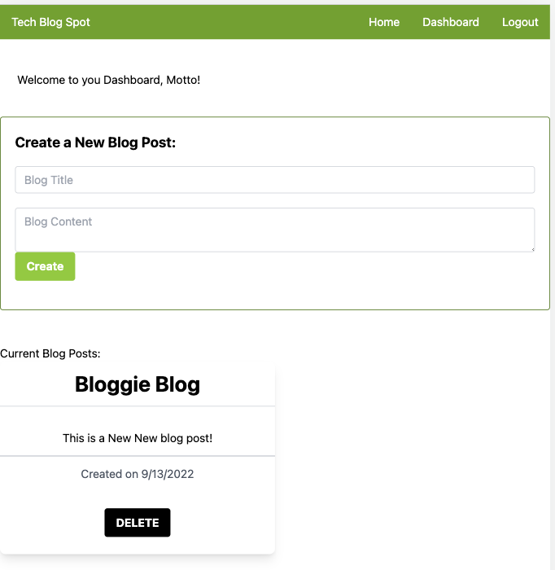

# Tech Blog Spot

 ## Description
  The Tech Blog Spot is an application built a place where developers can publish their blog posts and comment on other developers’ posts as well.  This application follows the MVC paradigm in its architectural structure, uses Handlebars.js as the template language, Sequelize as the ORM, and the express-session npm package for authentication.

  ## Table of Contents
  * [Installation](#installation)
  * [Usage](#usage)
  * [License](#license)
  * [Contributors](#contributors)
  * [Tests](#tests)
  * [Questions](#questions)

  ## Installation
 The packages required are:
     `bcrypt`
     `connect-session-sequelize`
     `dotenv`
     `express`
     `express-handlebars`
     `express-session`
     `mysql2`
     `sequelize`

  ## Usage
  
  To launch this application, click [here](https://ch-14-mvc-blog-spot.herokuapp.com/login).

  

  

  
  
  

  ## License
  This application is licensed under [MIT]((https://opensource.org/licenses/MIT)). 
    Copyright &copy; 2022 Jamie Otto
  

  ## Contributors
  Jamie Otto

  ## Tests 
  Run `npm test` in the command-line to test using [Jest](https://www.npmjs.com/package/jest).

  ## Questions
  If you have any questions about this project, please contact [jmotto31@gmail.com](mailto:jmotto31@gmail.com). To view more of my projects, go to [jmotto](https://github.com/jmotto).

